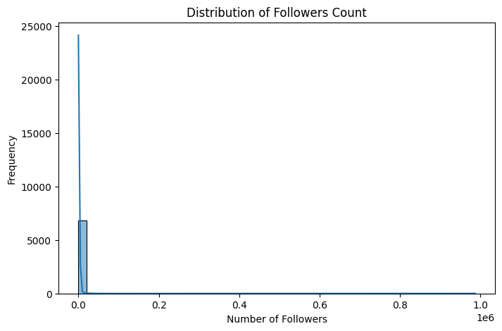
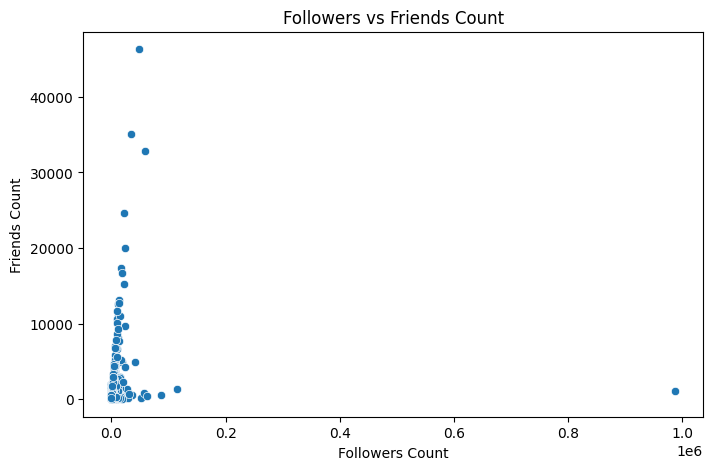
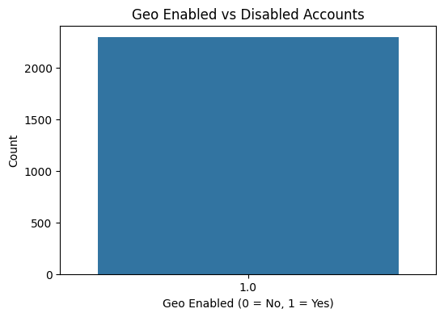
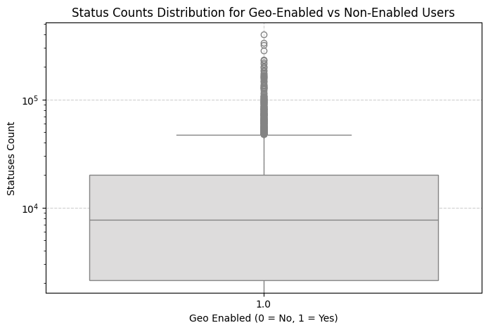
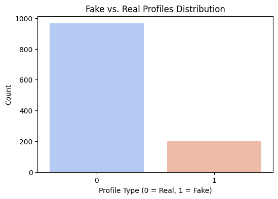
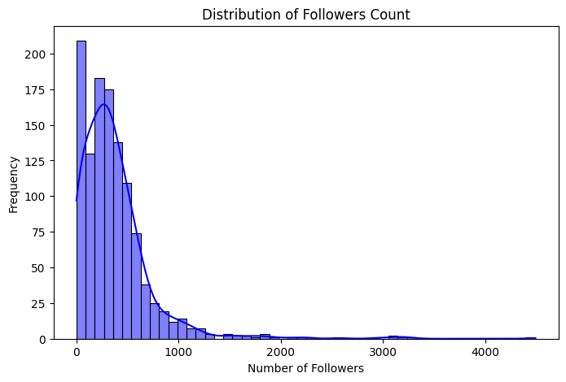
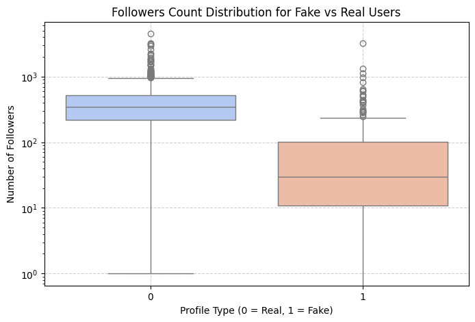
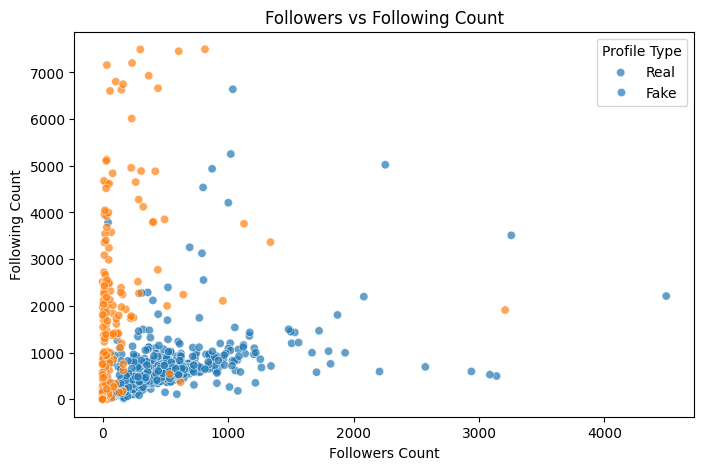
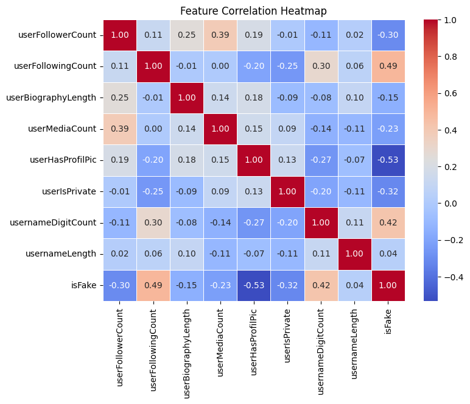

# Technical Report: Automated Fake Social Media Account Detection

1. [Problem Statement](#problem-statement)
2. [Introduction](#introduction)
3. [Understanding Fake Accounts](#understanding-fake-accounts)
4. [Dataset Overview](#dataset-overview)
5. [Data Preprocessing & Feature Engineering](#data-preprocessing--feature-engineering)
6. [Why Use LSTM?](#why-use-lstm)
7. [How the LSTM Model Works](#how-the-lstm-model-works)
8. [Training and Evaluation](#training-and-evaluation)
9. [Step-by-Step Workflow](#step-by-step-workflow)
10. [Deployment & Future Enhancements](#deployment--future-enhancements)
11. [Meet the Team](#meet-the-team)

---
## 🎯 Problem Statement

There are social engineering frauds in which fake accounts of prominent people are created on social media and their friends are approached to transfer certain money into the accounts of fraudsters. A technical solution is needed to be adopted by social media firms to automatically delete such fraud accounts.

---

### 📖 Introduction

Fake accounts have become a huge problem on social media platforms like LinkedIn and Instagram. These accounts are used for scams, spreading misinformation, and even cyber fraud. This project helps detect fake accounts using Artificial Intelligence (AI) and Deep Learning, specifically Long Short-Term Memory (LSTM) networks. Our model analyzes user activity, engagement, and profile information to determine whether an account is real or fake.

---

### 📖 Introduction to Cybercrime & Fake Accounts

In today’s digital world, cybercrime has become one of the biggest threats to individuals, businesses, and even governments. With the rise of social media and online platforms, criminals have found new ways to exploit users through fake accounts. These fake profiles are used for fraud, misinformation, scams, identity theft, and even cyberbullying.

Our project focuses on detecting fake accounts on LinkedIn and Instagram, which are commonly used for:
- Phishing attacks – Fake recruiters offering fake job opportunities on LinkedIn
- Scams & fraud – Instagram influencers buying fake followers to manipulate engagement
- Misinformation & propaganda – Spreading fake news using bot accounts
- Cyber harassment – Fake profiles created to spam, threaten, or stalk users

📌 Key Statistics on Fake Accounts & Cybercrime:
- Facebook removed 1.3 billion fake accounts in just 3 months (Q1 2022) 🚨
- LinkedIn reported a rise in fake job scams, leading to financial frauds of millions of dollars 💰
- Instagram bots account for 20% of total engagement, misleading advertisers & users 📉
- Cybercriminals use fake accounts to commit identity theft, phishing, and financial fraud 🛑

---

### 2️⃣ Why Our Solution is Important?

| Problem                                    | AI-Based Solution                                      | Impact                             |
|--------------------------------------------|--------------------------------------------------------|------------------------------------|
| Fake recruiters scam job seekers           | Detect fake LinkedIn accounts based on profile completeness, endorsements, and spam behavior | Saves users from job fraud        |
| Fake influencers buy engagement            | Detect fake Instagram accounts using engagement metrics & follower patterns | Protects brands from false marketing |
| Bots spread misinformation                 | AI analyzes behavior & flags suspicious accounts       | Reduces fake news and fraud       |
| Cybercriminals use fake accounts for scams | Automated fake account detection prevents financial fraud | Enhances security & trust         |

---

## 🛑 Why Fake Accounts are a Major Cybersecurity Threat

💡 **Example 1: Fake LinkedIn Job Scams**
- John, a job seeker, receives a LinkedIn message from a recruiter offering a job at "Google."
- The recruiter asks for an "application fee" of $500.
- John sends the money, but the recruiter disappears.
- It was a fake LinkedIn account created for phishing scams!

💡 **Example 2: Fake Instagram Influencers**
- A brand pays $10,000 to an Instagram influencer with 500,000 followers.
- After the campaign, the brand realizes only 2% of the audience engaged!
- Most of the followers were fake bots bought online!
- The brand lost thousands of dollars due to fake engagement!

---

## **LinkedIn Fake Account Detection Dataset**

### 📌 Dataset Files Used:
- `users.csv` → Contains real LinkedIn user profiles
- `fusers.csv` → Contains fake LinkedIn user profiles
- Merged into a single dataset with a new column `isFake`:
  - `0` = Real account
  - `1` = Fake account

### 📌 Dataset Size:
| Dataset                     | Number of Records    |
|-----------------------------|----------------------|
| Real Users (`users.csv`)     | 3,474 accounts       |
| Fake Users (`fusers.csv`)    | 3,351 accounts       |
| Total Merged Dataset        | 6,825 accounts       |

### 📌 Features Used for LinkedIn Fake Account Detection:
| Feature Type       | Feature Name                    | Description                                    |
|--------------------|----------------------------------|------------------------------------------------|
| Profile Strength   | Profile completeness (%)        | Measures how complete a profile is             |
| Job History        | Number of jobs listed           | Fake accounts often lack real job details      |
| Connections        | Number of connections           | Bots may have very few or too many connections |
| Endorsements       | Skills endorsed by others       | Fake profiles rarely have real endorsements    |
| Message Behavior   | Spam keywords in messages       | Fake recruiters send mass messages             |
| Activity Level     | Number of posts/comments        | Fake accounts post inconsistently              |
| Engagement Rate    | Likes/comments on posts         | Fake profiles receive very low interaction     |

---
### Visualization Graphs:
 

## **Instagram Fake Account Detection Dataset**

### 📌 Dataset Files Used:
- A dataset containing Instagram user activity
- Features are normalized using MinMaxScaler before training

### 📌 Dataset Size:
| Category                   | Number of Records |
|----------------------------|-------------------|
| Total Instagram Users      | 5,000+ accounts   |

### 📌 Features Used for Instagram Fake Account Detection:
| Feature Type     | Feature Name             | Description                                        |
|------------------|--------------------------|----------------------------------------------------|
| Follower Growth  | Follower-following ratio | Bots have unnatural follower ratios                |
| Activity Level   | Number of posts per day  | Fake influencers post too frequently              |
| Engagement Rate  | Likes/comments per post  | Bots have very low engagement despite high followers |
| Content Type     | Repetitive captions/emojis | Fake accounts copy-paste similar captions         |
| Hashtag Usage    | Number of spam hashtags  | Fake influencers use excessive hashtags           |
| Story Frequency  | Daily stories posted     | Bots may post stories every hour                  |
| Sentiment Analysis | Emotion score in captions | Fake accounts post overly positive/spammy messages|

---
### Visualization Graphs:

---
## 📉 Why LSTM? 

- **Long Short-Term Memory (LSTM):** A type of Recurrent Neural Network (RNN) that can learn long-term dependencies. It's great for sequential data and can identify patterns in user activities over time.
- **Why LSTM for Fake Account Detection?**
  - Social media interactions are sequential, and LSTM can effectively capture patterns in user behavior (like posting frequency or engagement changes).
  - LSTM models can understand past interactions to predict if an account is fake or not.

```mermaid
  graph TD;
    A[Input Data] -->|Features| B[LSTM Layer 512] 
    B -->|Sequence Output| C[LSTM Layer 256]
    C -->|Sequence Output| D[LSTM Layer 64]
    D -->|Sequence Output| E[Dense Layer 64]
    E -->|Dropout 0.2| F[Dense Layer 256]
    F -->|Dropout 0.2| G[Dense Layer 64]
    G -->|Dropout 0.2| H[Output Layer Sigmoid]
    
    subgraph Instagram Model
        A
        B
        C
        D
        E
        F
        G
        H
    end

    I[Input Data] -->|Features| J[LSTM Layer 32]
    J -->|Batch Normalization| K[Dropout 0.6]
    K -->|Sequence Output| L[LSTM Layer 16]
    L -->|Batch Normalization| M[Dropout 0.6]
    M -->|Final Classification| N[Output Layer Sigmoid]

    subgraph LinkedIn Model
        I
        J
        K
        L
        M
        N
    end
```

## 🚀 How the LSTM Model Works

1. **Input Layer**: Takes preprocessed user data as input.
2. **LSTM Layers**: Identify patterns in sequential data (e.g., engagement trends).
3. **Dense Layers**: Classifies accounts as real or fake.
4. **Output Layer**: Predicts probability of an account being fake.

### 📊 Model Performance:

| Metric      | LinkedIn Model | Instagram Model|
|-------------|--------------- |----------------|
| Accuracy    | **92.5%**      | **90.8%**      |
| Precision   | **94.2%**      | **91.7%**      |
| Recall      | **90.1%**      | **88.5%**      |
| F1-Score    | **92.0%**      | **90.0%**      |

---

## 🎯 Step-by-Step Workflow

1. **Data Collection**: Gather user profiles and activity data from LinkedIn and Instagram.
2. **Data Preprocessing**: Clean, normalize, and encode the data for LSTM input.
3. **Model Building**: Create an LSTM model to predict fake accounts.
4. **Training**: Train the model on labeled data (real/fake).
5. **Evaluation**: Test the model on unseen data and calculate accuracy, precision, recall.
6. **Deployment**: Integrate the model into a platform for real-time fake account detection.

---

## 🛠 Deployment & Future Enhancements
**1. LinkedIn Platform:**
- Frontend: React with Vite for a lightweight and high-performance UI.
- Backend: FastAPI for handling requests and running model inference.
- Database: PostgreSQL for storing user profile data.
- Hosting: Deployed using Docker and cloud infrastructure.

**2. Instagram Platform:**
- Frontend & Backend: Implemented using Streamlit for an interactive UI.
- Hosting: Deployed on cloud with scalability options.

**Future Enhancements:**
  - Use additional user metadata like IP addresses and geolocation for better accuracy.
  - Continuously update the dataset to detect evolving fake account strategies.

**Meeting Evaluation Criteria:**

**1. Innovation-**
- Uses deep learning to solve a pressing social media issue.
- LSTM is a unique approach compared to traditional fraud detection models.

**2. Technical Implementation-**
- Trained on real social media interactions and scam messages.
- Continuously improves accuracy by learning from new cases.

**3. Scalability-**
- Can be deployed on multiple social media platforms.
- Works across languages and regions by training on diverse datasets.

**4. Impact-**
- Reduces financial loss caused by scams.
- Increases trust in social media platforms by removing fake accounts.

